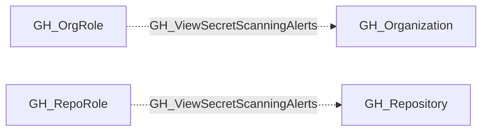

# GH_ViewSecretScanningAlerts

## General Information

The non-traversable GH_ViewSecretScanningAlerts edge represents that a role can view secret scanning alerts at the organization or repository level. This edge is dynamically generated from custom role permissions discovered by the collector. Secret scanning alerts may reveal details about leaked credentials, including partial or full secret values and the locations where they were detected. This makes the permission significant for security because an attacker with access to view these alerts could harvest exposed credentials for use in lateral movement or privilege escalation.

## Edge Schema

| Source | Destination | Traversable |
| --- | --- | --- |
| `GH_OrgRole` | `GH_Organization` | `false` |
| `GH_RepoRole` | `GH_Repository` | `false` |

## Diagram

