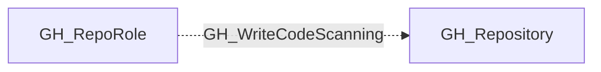

# GH_WriteCodeScanning

## General Information

The non-traversable GH_WriteCodeScanning edge represents a role's ability to upload code scanning analysis results. This permission is available to Write, Maintain, and Admin roles and custom roles that have been granted this specific permission. An attacker could upload falsified SARIF results to suppress real alerts or inject misleading findings.

## Edge Schema

| Source | Destination | Traversable |
| --- | --- | --- |
| `GH_RepoRole` | `GH_Repository` | `false` |

## Diagram

