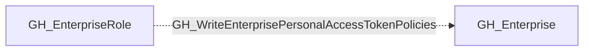

# GH_WriteEnterprisePersonalAccessTokenPolicies

## General Information

[Enterprise] Enterprise role can write personal access token policies.

## Diagram

```mermaid
graph LR
    n0["GH_EnterpriseRole"]
    n1["GH_Enterprise"]
    n0 -.->|GH_WriteEnterprisePersonalAccessTokenPolicies| n1
```

## References

- [Enterprise roles](https://docs.github.com/en/enterprise-cloud@latest/rest/enterprise-admin/enterprise-roles)
