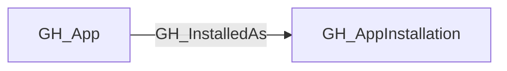

# GH_App

## General Information

Represents a GitHub App definition — the registered application entity. The app owner holds the private key that can generate installation access tokens for **every** GH_AppInstallation of this app. If the private key is compromised, all installations across all organizations are affected.

App definitions are retrieved via the public `GET /apps/{app_slug}` endpoint (no authentication required) after discovering unique app slugs from the organization's app installations.

## Properties

| Property | Type | Description |
| --- | --- | --- |
| `name` | `string` | The node name used for matching and display. |
| `displayname` | `string` | The human-readable display name. |
| `environmentid` | `string` | The identifier of the GitHub environment where this node was collected. |
| `last_seen` | `datetime` | The timestamp when this node was last observed during collection. |
| `node_id` | `string` | The stable identifier used as the OpenGraph node ID; this is the native GitHub node ID where available. |
| `id` | `integer` | The GitHub App's numeric ID. |
| `client_id` | `string` | The app's OAuth client ID. |
| `slug` | `string` | The app's URL-friendly slug identifier. |
| `description` | `string` | The app's description. |
| `external_url` | `string` | The app's external homepage URL. |
| `html_url` | `string` | URL to the app's GitHub page. |
| `owner_login` | `string` | The login of the user or organization that owns the app. |
| `owner_node_id` | `string` | The node_id of the user or organization that owns the app. |
| `owner_type` | `string` | The type of the owner (e.g., `User`, `Organization`). |
| `events` | `list[string]` | JSON string of the default webhook events the app subscribes to. |
| `installations_count` | `integer` | The total number of installations of this app across all organizations. |
| `created_at` | `datetime` | When the app was created. |
| `updated_at` | `datetime` | When the app was last updated. |
| `query_installations` | `string` | Query for installations. |

## Diagram

