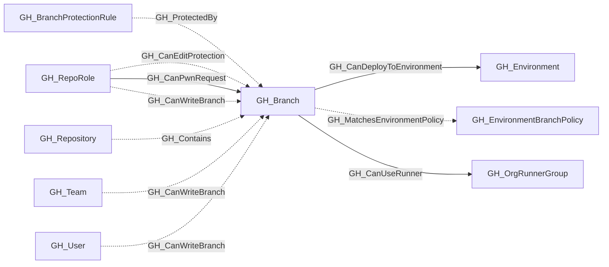

# GH_Branch

## General Information

Represents a Git branch within a repository. Branch nodes capture basic branch information and whether the branch is protected. Protection rule details are stored in separate GH_BranchProtectionRule nodes, linked via GH_ProtectedBy edges.

## Properties

| Property | Type | Description |
| --- | --- | --- |
| `name` | `string` | The node name used for matching and display. |
| `displayname` | `string` | The human-readable display name. |
| `environmentid` | `string` | The identifier of the GitHub environment where this node was collected. |
| `last_seen` | `datetime` | The timestamp when this node was last observed during collection. |
| `node_id` | `string` | The stable identifier used as the OpenGraph node ID; this is the native GitHub node ID where available. |
| `collected` | `boolean` | Collected/generated by OpenHound. |
| `short_name` | `string` | The branch reference name (e.g., `main`). |
| `commit_hash` | `string` | The commit hash property. |
| `protected` | `boolean` | Whether the branch has a protection rule. |
| `repository_name` | `string` | The repository name property. |
| `repository_id` | `string` | The repository id property. |
| `environment_name` | `string` | The name of the environment (GitHub organization). |
| `query_branch_write` | `string` | Query for branch write. |

## Diagram

