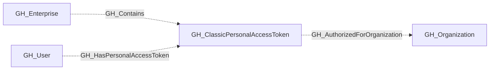

# GH_ClassicPersonalAccessToken

## General Information

A classic personal access token found in the enterprise credential inventory.

## Properties

| Property | Type | Description |
| --- | --- | --- |
| `name` | `string` | The node name used for matching and display. |
| `displayname` | `string` | The human-readable display name. |
| `environmentid` | `string` | The identifier of the GitHub environment where this node was collected. |
| `last_seen` | `datetime` | The timestamp when this node was last observed during collection. |
| `node_id` | `string` | The stable identifier used as the OpenGraph node ID; this is the native GitHub node ID where available. |
| `credential_id` | `integer` | GitHub's ID for this classic personal access token. |
| `owner_id` | `integer` | GitHub's numeric ID for the token owner. |
| `owner_login` | `string` | Login of the token owner. |
| `scopes` | `list[string]` | OAuth scopes granted to the token. |
| `credential_state` | `string` | Whether GitHub reports the credential as active, expired, revoked, or deleted. |
| `expiry_status` | `string` | Whether expiration is scheduled, never, or unknown. |
| `enterprise_authorized` | `boolean` | Whether the credential is authorized directly for the enterprise. |
| `authorization_count` | `integer` | Total organization authorizations plus enterprise authorization. |
| `inventory_as_of` | `string` | Timestamp of the export snapshot used to observe the token. |
| `created_at` | `datetime` | Token creation time reported by GitHub. |
| `last_used_at` | `datetime` | Last use time reported by GitHub. |
| `expires_at` | `datetime` | Token expiration time reported by GitHub. |
| `authorized_organizations` | `list[string]` | Organizations with a reported credential authorization. |
| `environment_name` | `string` | Enterprise environment name. |
| `enterprise_name` | `string` | Enterprise from which the inventory was exported. |

## Diagram

