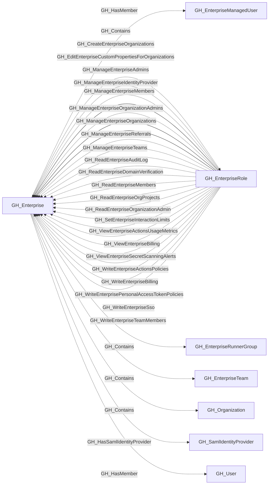

# GH_Enterprise

## General Information

A GitHub Enterprise account that contains organizations, enterprise teams, roles, and managed users.

## Properties

| Property | Type | Description |
| --- | --- | --- |
| `name` | `string` | The node name used for matching and display. |
| `displayname` | `string` | The human-readable display name. |
| `environmentid` | `string` | The identifier of the GitHub environment where this node was collected. |
| `last_seen` | `datetime` | The timestamp when this node was last observed during collection. |
| `node_id` | `string` | The stable identifier used as the OpenGraph node ID; this is the native GitHub node ID where available. |
| `collected` | `boolean` | Whether this node was collected directly. |
| `slug` | `string` | The enterprise slug. |
| `enterprise_name` | `string` | The enterprise display name. |
| `description` | `string` | The enterprise description. |
| `location` | `string` | The enterprise location. |
| `url` | `string` | The enterprise GitHub URL. |
| `website_url` | `string` | The enterprise website URL. |
| `created_at` | `string` | When the enterprise was created. |
| `updated_at` | `string` | When the enterprise was last updated. |
| `billing_email` | `string` | The enterprise billing email. |
| `security_contact_email` | `string` | The enterprise security contact email. |
| `viewer_is_admin` | `boolean` | Whether the authenticated viewer is an enterprise admin. |
| `environment_name` | `string` | The enterprise environment name. |
| `query_organizations` | `string` | Query for contained organizations. |

## Diagram

