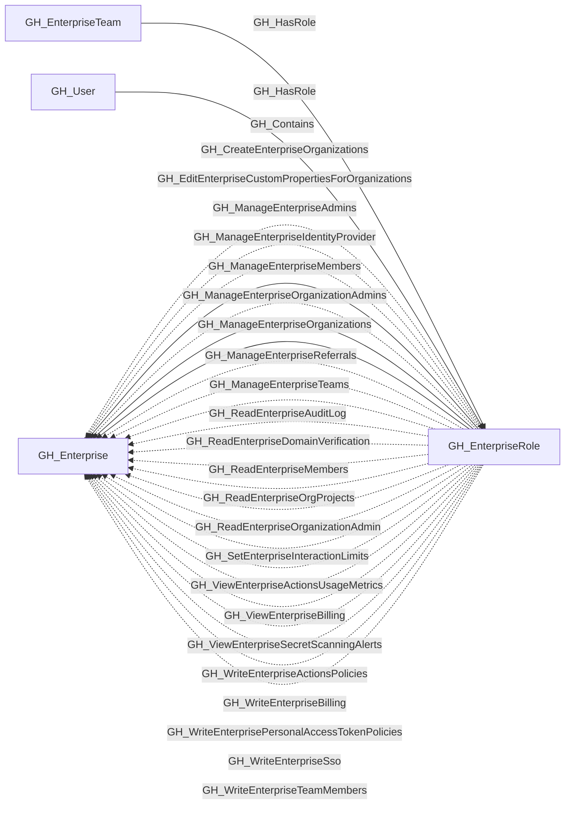

# GH_EnterpriseRole

## General Information

The role a user or team has at the GitHub Enterprise level.

## Properties

| Property | Type | Description |
| --- | --- | --- |
| `name` | `string` | The node name used for matching and display. |
| `displayname` | `string` | The human-readable display name. |
| `environmentid` | `string` | The identifier of the GitHub environment where this node was collected. |
| `last_seen` | `datetime` | The timestamp when this node was last observed during collection. |
| `node_id` | `string` | The stable identifier used as the OpenGraph node ID; this is the native GitHub node ID where available. |
| `github_role_id` | `string or integer` | The raw GitHub role ID. |
| `short_name` | `string` | The role short name. |
| `description` | `string` | The role description. |
| `source` | `string` | The role source. |
| `type` | `string` | The role type. |
| `created_at` | `string` | When the role was created. |
| `updated_at` | `string` | When the role was last updated. |
| `permissions` | `list[string]` | Raw enterprise permission strings. |
| `environment_name` | `string` | The enterprise environment name. |
| `query_enterprise` | `string` | Query for the containing enterprise. |
| `query_explicit_members` | `string` | Query for direct user members. |
| `query_team_members` | `string` | Query for team-assigned members. |

## Diagram

