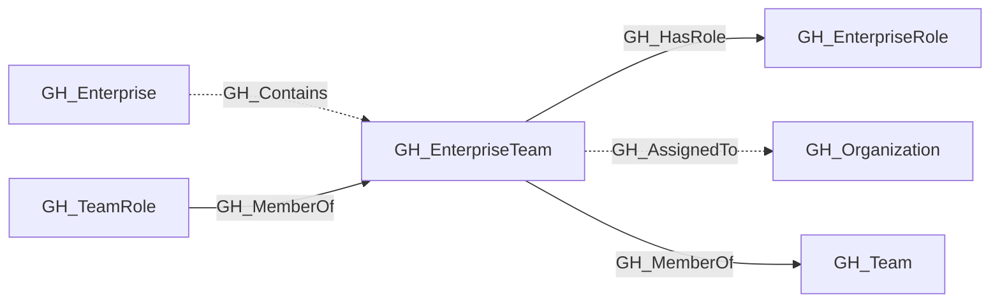

# GH_EnterpriseTeam

## General Information

A team managed at the GitHub Enterprise level and assignable across organizations.

## Properties

| Property | Type | Description |
| --- | --- | --- |
| `name` | `string` | The node name used for matching and display. |
| `displayname` | `string` | The human-readable display name. |
| `environmentid` | `string` | The identifier of the GitHub environment where this node was collected. |
| `last_seen` | `datetime` | The timestamp when this node was last observed during collection. |
| `node_id` | `string` | The stable identifier used as the OpenGraph node ID; this is the native GitHub node ID where available. |
| `github_team_id` | `string or integer` | The raw GitHub enterprise team ID. |
| `slug` | `string` | The enterprise team slug. |
| `projected_slug` | `string` | The organization-projected team slug. |
| `group_id` | `string` | The linked SCIM group ID. |
| `description` | `string` | The team description. |
| `created_at` | `string` | When the team was created. |
| `updated_at` | `string` | When the team was last updated. |
| `environment_name` | `string` | The enterprise environment name. |
| `query_enterprise` | `string` | Query for the containing enterprise. |
| `query_assigned_organizations` | `string` | Query for assigned organizations. |
| `query_projected_teams` | `string` | Query for projected organization teams. |
| `query_members` | `string` | Query for team members. |

## Diagram

