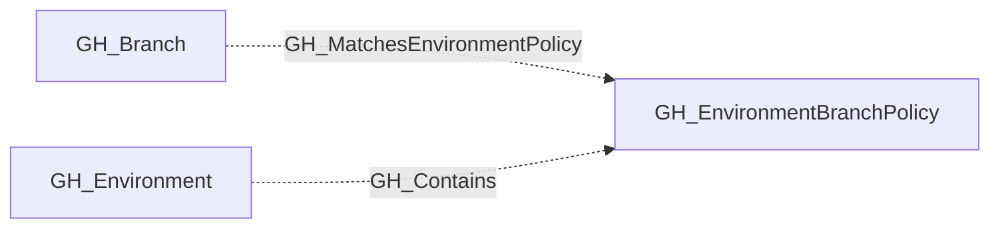

# GH_EnvironmentBranchPolicy

## General Information

Represents a deployment branch policy attached to a GitHub Environment. These policies define which branches or branch patterns are allowed to deploy to the environment, such as `main`, `release/*`, or `release/**/*`.

Environment branch policies are modeled as their own nodes so analysts can distinguish between the environment itself and the matching rules that govern deployment eligibility.

## Properties

| Property | Type | Description |
| --- | --- | --- |
| `name` | `string` | The node name used for matching and display. |
| `displayname` | `string` | The human-readable display name. |
| `environmentid` | `string` | The identifier of the GitHub environment where this node was collected. |
| `last_seen` | `datetime` | The timestamp when this node was last observed during collection. |
| `node_id` | `string` | The stable identifier used as the OpenGraph node ID; this is the native GitHub node ID where available. |
| `environment_name` | `string` | The environment name value. |
| `repository_name` | `string` | The repository name value. |

## Diagram

