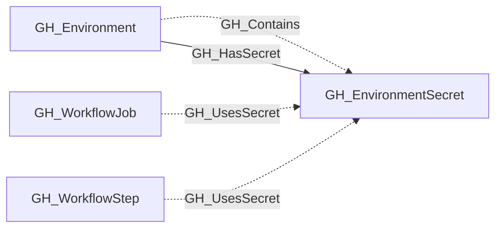

# GH_EnvironmentSecret

## General Information

Represents an environment-level GitHub Actions secret. These secrets are scoped to a specific deployment environment and are only available to workflow jobs that reference that environment.

The containing environment is linked to the secret with GH_Contains and GH_HasSecret edges. Workflow steps that reference the secret by name receive GH_UsesSecret edges when their job targets the same environment.

## Properties

| Property | Type | Description |
| --- | --- | --- |
| `name` | `string` | The node name used for matching and display. |
| `displayname` | `string` | The human-readable display name. |
| `environmentid` | `string` | The identifier of the GitHub environment where this node was collected. |
| `last_seen` | `datetime` | The timestamp when this node was last observed during collection. |
| `node_id` | `string` | The stable identifier used as the OpenGraph node ID; this is the native GitHub node ID where available. |
| `deployment_environment_name` | `string` | The name of the containing deployment environment. |
| `deployment_environmentid` | `string` | The node_id of the containing deployment environment. |
| `repository_name` | `string` | The repository name property. |
| `repository_id` | `string` | The repository id property. |
| `environment_name` | `string` | The name of the environment (GitHub organization). |
| `created_at` | `string` | When the secret was created. |
| `updated_at` | `string` | When the secret was last updated. |

## Diagram

