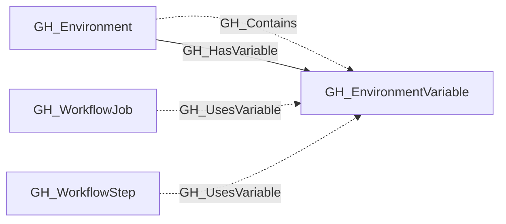

# GH_EnvironmentVariable

## General Information

Represents an environment-level GitHub Actions variable. These variables are scoped to a specific deployment environment and are only available to workflow jobs that reference that environment. Unlike secrets, variable values are readable via the API.

The containing environment is linked to the variable with GH_Contains and GH_HasVariable edges. Workflow steps that reference the variable by name receive GH_UsesVariable edges when their job targets the same environment.

## Properties

| Property | Type | Description |
| --- | --- | --- |
| `name` | `string` | The node name used for matching and display. |
| `displayname` | `string` | The human-readable display name. |
| `environmentid` | `string` | The identifier of the GitHub environment where this node was collected. |
| `last_seen` | `datetime` | The timestamp when this node was last observed during collection. |
| `node_id` | `string` | The stable identifier used as the OpenGraph node ID; this is the native GitHub node ID where available. |
| `environment_name` | `string` | The name of the environment (GitHub organization). |
| `deployment_environment_name` | `string` | The name of the deployment environment (GitHub organization). |
| `value` | `string` | The plaintext value of the variable. |
| `created_at` | `datetime` | When the variable was created. |
| `updated_at` | `datetime` | When the variable was last updated. |
| `repository_name` | `string` | The name of the containing repository. |
| `repository_id` | `string` | The id of the containing repository. |
| `deployment_environmentid` | `string` | The deployment environmentid value. |

## Diagram

