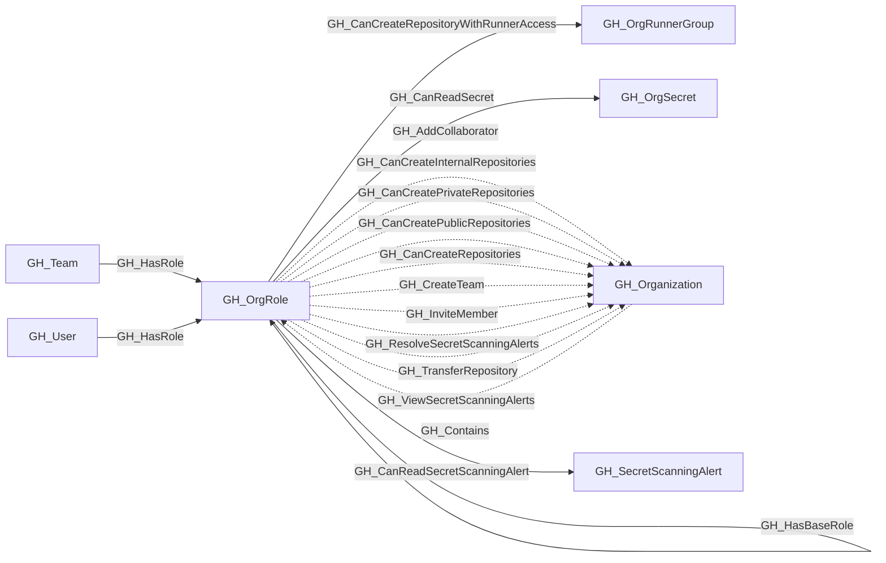

# GH_OrgRole

## General Information

Represents an organization-level role such as Owner, Member, or a custom organization role. Org roles define what permissions a user or team has at the organization level. The Owner and Member roles are default (built-in), while custom roles inherit from a base role and can have additional permissions.

## Properties

| Property | Type | Description |
| --- | --- | --- |
| `name` | `string` | The node name used for matching and display. |
| `displayname` | `string` | The human-readable display name. |
| `environmentid` | `string` | The identifier of the GitHub environment where this node was collected. |
| `last_seen` | `datetime` | The timestamp when this node was last observed during collection. |
| `node_id` | `string` | The stable identifier used as the OpenGraph node ID; this is the native GitHub node ID where available. |
| `short_name` | `string` | The short display name of the role (e.g., `Owners`, `Members`, or the custom role name). |
| `type` | `string` | `default` for built-in roles (Owner, Member) or `custom` for custom organization roles. |
| `environment_name` | `string` | The name of the environment (GitHub organization). |
| `query_explicit_members` | `string` | Query for explicit members. |
| `query_unrolled_members` | `string` | Query for unrolled members. |
| `query_org_permissions` | `string` | Query for org permissions. |
| `query_repo_permissions` | `string` | Query for repo permissions. |

## Diagram

