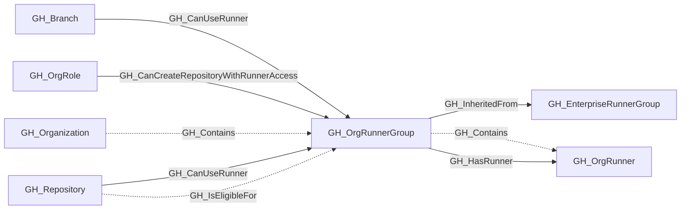

# GH_OrgRunnerGroup

## General Information

Represents a self-hosted runner group visible within a GitHub organization. Organization runner groups may either be native to the organization or inherited from an enterprise runner group.

Native organization runner groups contain GH_OrgRunner nodes directly. Direct memberships also emit GH_HasRunner to represent the traversable capability hop from the group to its runners. Inherited organization runner groups do not directly contain organization runners; instead, they link to the source GH_EnterpriseRunnerGroup through GH_InheritedFrom and gain access to the enterprise runners contained there. GH_IsEligibleFor edges from repositories describe repository access policy scope, while GH_CanUseRunner edges identify repositories and branches that can dispatch workflows to the group under the collected Actions and workflow-restriction settings.

## Properties

| Property | Type | Description |
| --- | --- | --- |
| `name` | `string` | The node name used for matching and display. |
| `displayname` | `string` | The human-readable display name. |
| `environmentid` | `string` | The identifier of the GitHub environment where this node was collected. |
| `last_seen` | `datetime` | The timestamp when this node was last observed during collection. |
| `node_id` | `string` | The stable identifier used as the OpenGraph node ID; this is the native GitHub node ID where available. |
| `scope` | `string` | Whether the runner group is enterprise or organization scoped. |
| `group_id` | `integer` | The GitHub runner group ID. |
| `group_name` | `string` | The runner group display name. |
| `visibility` | `string` | Which repositories can use this group: `all`, `private`, or `selected`. |
| `default` | `boolean` | Whether this is the default runner group. |
| `inherited` | `boolean` | Whether this runner group is inherited. |
| `allows_public_repositories` | `boolean` | Whether public repositories may use this group. |
| `restricted_to_workflows` | `boolean` | Whether access is restricted to selected workflows. |
| `selected_workflows` | `string` | JSON array of selected workflows, if configured. |
| `runners_url` | `string` | API URL for runners in this group. |
| `selected_organizations_url` | `string` | API URL for organizations assigned to an enterprise group. |
| `environment_name` | `string` | The name of the environment (GitHub organization or enterprise). |
| `query_runners` | `string` | Query for runners. |
| `query_organizations` | `string` | Query for organizations inheriting an enterprise runner group. |
| `query_repositories` | `string` | Query for repositories. |

## Diagram

