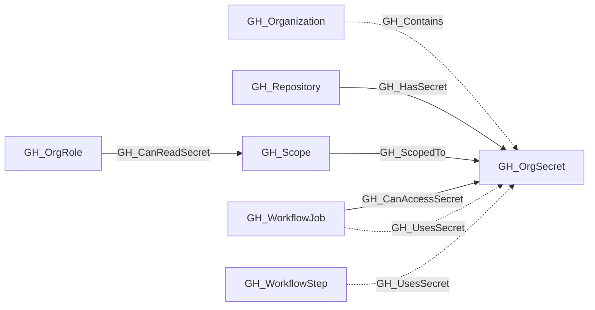

# GH_OrgSecret

## General Information

Represents an organization-level GitHub Actions secret. All and private/internal visibility uses shared organization-secret GH_Scope nodes; arbitrary selected visibility uses direct GH_HasSecret relationships from repositories.

## Properties

| Property | Type | Description |
| --- | --- | --- |
| `name` | `string` | The node name used for matching and display. |
| `displayname` | `string` | The human-readable display name. |
| `environmentid` | `string` | The identifier of the GitHub environment where this node was collected. |
| `last_seen` | `datetime` | The timestamp when this node was last observed during collection. |
| `node_id` | `string` | The stable identifier used as the OpenGraph node ID; this is the native GitHub node ID where available. |
| `visibility` | `string` | The secret's visibility scope: `all` (all repos), `private` (private and internal repos), or `selected` (specific repos). |
| `environment_name` | `string` | The name of the environment (GitHub organization). |
| `created_at` | `string` | When the secret was created. |
| `updated_at` | `string` | When the secret was last updated. |
| `query_visible_repositories` | `string` | Query for visible repositories. |
| `selected_repositories_url` | `string` | The selected repositories url property. |

## Diagram

