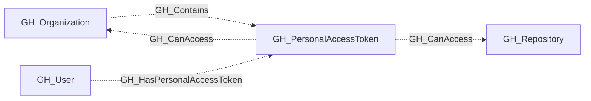

# GH_PersonalAccessToken

## General Information

Represents a fine-grained personal access token that has been granted access to organization resources. PATs are linked to their owning user, the organization, and the repositories they can access.

The granted permissions are stored separately as `organization_permissions` and `repository_permissions`. Each property is a list of `scope:access` values such as `members:read` or `contents:write`, matching the permission format used on GH_WorkflowJob nodes.

## Properties

| Property | Type | Description |
| --- | --- | --- |
| `name` | `string` | The node name used for matching and display. |
| `displayname` | `string` | The human-readable display name. |
| `environmentid` | `string` | The identifier of the GitHub environment where this node was collected. |
| `last_seen` | `datetime` | The timestamp when this node was last observed during collection. |
| `node_id` | `string` | The stable identifier used as the OpenGraph node ID; this is the native GitHub node ID where available. |
| `environment_name` | `string` | The name of the environment (GitHub organization) where the token has access. |
| `owner_id` | `string` | The GitHub ID of the token owner. |
| `owner_node_id` | `string` | The GraphQL node ID of the token owner. |
| `token_expires_at` | `datetime` | The ISO 8601 timestamp of when the token expires. |
| `token_last_used_at` | `datetime` | The ISO 8601 timestamp of when the token was last used. |
| `access_granted_at` | `datetime` | The ISO 8601 timestamp of when the token was granted to the organization. |
| `organization_permissions` | `list[string]` | Organization-scoped permissions in `scope:access` form. |
| `repository_permissions` | `list[string]` | Repository-scoped permissions in `scope:access` form. |
| `token_name` | `string` | The user-assigned display name of the token. |
| `owner_login` | `string` | The login handle of the user who owns the token. |
| `repository_selection` | `string` | Whether the token has access to `all`, `subset`, or `none` of the organization's repositories. |
| `token_expired` | `boolean` | Whether the token has expired. |
| `query_organization_permissions` | `string` | Query for organization permissions. |
| `query_user` | `string` | Query for user. |
| `query_repositories` | `string` | Query for repositories. |

## Diagram

