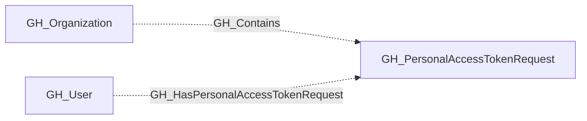

# GH_PersonalAccessTokenRequest

## General Information

Represents a pending request from an organization member to access organization resources with a fine-grained personal access token. PAT requests are linked to their owning user and the organization.

The requested permissions are stored separately as `organization_permissions` and `repository_permissions`. Each property is a list of `scope:access` values such as `members:read` or `contents:write`, matching the permission format used on GH_WorkflowJob nodes.

## Properties

| Property | Type | Description |
| --- | --- | --- |
| `name` | `string` | The node name used for matching and display. |
| `displayname` | `string` | The human-readable display name. |
| `environmentid` | `string` | The identifier of the GitHub environment where this node was collected. |
| `last_seen` | `datetime` | The timestamp when this node was last observed during collection. |
| `node_id` | `string` | The stable identifier used as the OpenGraph node ID; this is the native GitHub node ID where available. |
| `token_name` | `string` | The user-assigned display name of the token. |
| `owner_login` | `string` | The login handle of the user who submitted the request. |
| `repository_selection` | `string` | Whether the request targets `all`, `subset`, or `none` of the organization's repositories. |
| `reason` | `string` | The rationale provided by the requester for the access request. |
| `org_name` | `string` | The org name property. |
| `organization_permissions` | `list[string]` | Requested organization-scoped permissions in `scope:access` form. |
| `repository_permissions` | `list[string]` | Requested repository-scoped permissions in `scope:access` form. |
| `query_organization_permissions` | `string` | Query for organization permissions. |
| `query_user` | `string` | Query for user. |
| `query_repositories` | `string` | Query for repositories. |

## Diagram

