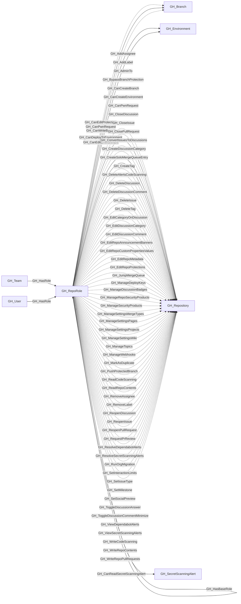

# GH_RepoRole

## General Information

Represents a repository-level permission role. Each repository has five default roles (Read, Write, Admin, Triage, Maintain) plus any custom repository roles defined at the organization level. Repo roles define what actions a user or team can perform on a specific repository. Default roles form an inheritance hierarchy (Triage -> Read, Maintain -> Write, Admin includes all), and custom roles inherit from one of the base roles.

## Properties

| Property | Type | Description |
| --- | --- | --- |
| `name` | `string` | The node name used for matching and display. |
| `displayname` | `string` | The human-readable display name. |
| `environmentid` | `string` | The identifier of the GitHub environment where this node was collected. |
| `last_seen` | `datetime` | The timestamp when this node was last observed during collection. |
| `node_id` | `string` | The stable identifier used as the OpenGraph node ID; this is the native GitHub node ID where available. |
| `short_name` | `string` | The short role name (e.g., `read`, `write`, `admin`, `triage`, `maintain`, or custom role name). |
| `repository_name` | `string` | The name of the repository this role belongs to. |
| `repository_id` | `string` | The node_id of the repository this role belongs to. |
| `environment_name` | `string` | The name of the environment (GitHub organization). |
| `type` | `string` | `default` for built-in roles or `custom` for custom repository roles. |
| `query_explicit_users` | `string` | Query for explicit users. |
| `query_explicit_teams` | `string` | Query for explicit teams. |
| `query_unrolled_members` | `string` | Query for unrolled members. |
| `query_repository_permissions` | `string` | Query for repository permissions. |

## Diagram

