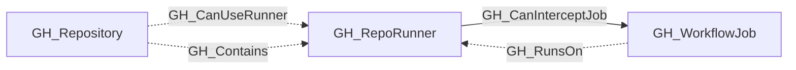

# GH_RepoRunner

## General Information

Represents a self-hosted runner registered directly to a single GitHub repository. Repository runners are contained by that repository and may only be used by workflows in that repository.

The node captures runner metadata such as operating system, status, busy state, labels, and whether the runner is ephemeral when GitHub returns that property.

GH_RunsOn edges from GH_WorkflowJob nodes identify statically resolvable jobs in the containing repository that GitHub could schedule on this runner. These edges do not indicate that the job has actually executed on the runner.

When the runner is not explicitly marked ephemeral, GH_CanInterceptJob edges identify workflow jobs whose future execution context may be exposed to an actor controlling the runner.

## Properties

| Property | Type | Description |
| --- | --- | --- |
| `name` | `string` | The node name used for matching and display. |
| `displayname` | `string` | The human-readable display name. |
| `environmentid` | `string` | The identifier of the GitHub environment where this node was collected. |
| `last_seen` | `datetime` | The timestamp when this node was last observed during collection. |
| `node_id` | `string` | The stable identifier used as the OpenGraph node ID; this is the native GitHub node ID where available. |
| `scope` | `string` | Whether the runner is enterprise, organization, or repository scoped. |
| `runner_id` | `integer` | The GitHub runner ID. |
| `os` | `string` | The runner operating system. |
| `status` | `string` | The runner status. |
| `busy` | `boolean` | Whether the runner is currently busy. |
| `ephemeral` | `boolean` | Whether the runner is ephemeral. |
| `labels` | `string` | JSON array of runner labels. |
| `runner_group_id` | `integer` | The associated runner group ID. |
| `runner_group_name` | `string` | The associated runner group name. |
| `runner_group_visibility` | `string` | Runner group visibility when organization scoped. |
| `repository_name` | `string` | The repository name for repository-scoped runners. |
| `repository_id` | `string` | The repository node_id for repository-scoped runners. |
| `repository_full_name` | `string` | The full repository name for repository-scoped runners. |
| `environment_name` | `string` | The name of the environment (GitHub organization). |
| `query_group` | `string` | Query for group. |
| `query_repositories` | `string` | Query for repositories. |
| `query_jobs` | `string` | Query for workflow jobs that can be scheduled on the runner. |
| `query_interceptable_jobs` | `string` | Query for workflow jobs the runner can intercept. |

## Diagram

