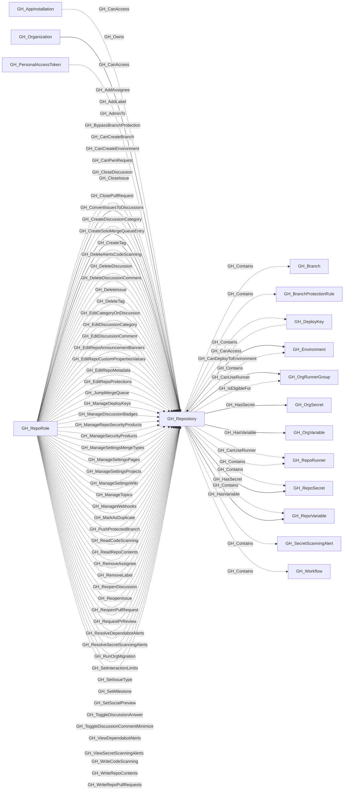

# GH_Repository

## General Information

Represents a GitHub repository within the organization. Repository nodes capture metadata about the repo including visibility, Actions enablement status, and security configuration. Repository role nodes (GH_RepoRole) are created alongside each repository to represent the permission levels available.

For repositories with active workflows, the collector records the applicable default workflow permissions and whether workflows may approve pull request reviews. These properties preserve the repository-level policy input later used to derive effective GITHUB_TOKEN permissions for GH_WorkflowJob nodes.

The `branch_count` and `environment_count` properties preserve GitHub-reported totals from the repository GraphQL response. These values can be compared to collected GH_Branch and GH_Environment children to identify incomplete collection before relying on branch- or environment-dependent analysis.

## Properties

| Property | Type | Description |
| --- | --- | --- |
| `name` | `string` | The node name used for matching and display. |
| `displayname` | `string` | The human-readable display name. |
| `environmentid` | `string` | The identifier of the GitHub environment where this node was collected. |
| `last_seen` | `datetime` | The timestamp when this node was last observed during collection. |
| `node_id` | `string` | The stable identifier used as the OpenGraph node ID; this is the native GitHub node ID where available. |
| `collected` | `boolean` | Collected/generated by OpenHound. |
| `full_name` | `string` | The fully qualified name (e.g., `org/repo`). |
| `private` | `boolean` | Whether the repository is private. |
| `html_url` | `string` | URL to the repository on GitHub. |
| `description` | `string` | The repository description. |
| `created_at` | `string` | When the repository was created. |
| `updated_at` | `string` | When the repository was last updated. |
| `pushed_at` | `string` | When the repository last had a push. |
| `archived` | `boolean` | Whether the repository is archived. |
| `disabled` | `boolean` | Whether the repository is disabled. |
| `visibility` | `string` | The visibility level: `public`, `private`, or `internal`. |
| `default_branch` | `string` | The name of the default branch (e.g., `main`). |
| `size` | `integer` | Repository size in kilobytes as reported by GitHub. |
| `open_issues_count` | `integer` | Number of open issues. |
| `allow_forking` | `boolean` | Whether forking is allowed. |
| `web_commit_signoff_required` | `boolean` | Whether web-based commits require sign-off. |
| `forks` | `integer` | Number of forks. |
| `open_issues` | `integer` | Number of open issues (includes pull requests). |
| `watchers` | `integer` | Number of watchers. |
| `owner_name` | `string` | The login of the repository owner. |
| `owner_id` | `string` | The owner id property. |
| `environment_name` | `string` | The name of the environment (GitHub organization). |
| `actions_enabled` | `boolean` | Whether GitHub Actions is enabled for this repository. |
| `self_hosted_runners_enabled` | `boolean` | Whether the repository may use self-hosted runners. |
| `default_workflow_permissions` | `string` | The repository's applicable default GITHUB_TOKEN workflow permissions. |
| `can_approve_pull_request_reviews` | `boolean` | Whether workflows may approve pull request reviews. |
| `secret_scanning` | `string` | Status of secret scanning (e.g., `enabled`, `disabled`). |
| `branch_ruleset_count` | `integer` | Number of branch-targeted rulesets that apply to this repository. |
| `has_branch_rulesets` | `boolean` | Whether at least one branch-targeted ruleset applies to this repository. |
| `branch_count` | `integer` | Number of branch refs reported by GitHub for this repository. |
| `environment_count` | `integer` | Number of deployment environments reported by GitHub for this repository. |
| `deploy_key_count` | `integer` | Number of deploy keys reported by GitHub for this repository. |
| `query_branches` | `string` | Query for branches. |
| `query_protected_branches` | `string` | Query for protected branches. |
| `query_branch_protection_rules` | `string` | Query for branch protection rules. |
| `query_roles` | `string` | Query for roles. |
| `query_teams` | `string` | Query for teams. |
| `query_workflows` | `string` | Query for workflows. |
| `query_runners` | `string` | Query for runners. |
| `query_environments` | `string` | Query for environments. |
| `query_secrets` | `string` | Query for secrets. |
| `query_variables` | `string` | Query for variables. |
| `query_deploy_keys` | `string` | Query for deploy keys. |
| `query_secret_scanning_alerts` | `string` | Query for secret scanning alerts. |
| `query_explicit_readers` | `string` | Query for explicit readers. |
| `query_unrolled_readers` | `string` | Query for unrolled readers. |
| `query_explicit_writers` | `string` | Query for explicit writers. |
| `query_unrolled_writers` | `string` | Query for unrolled writers. |

## Diagram

