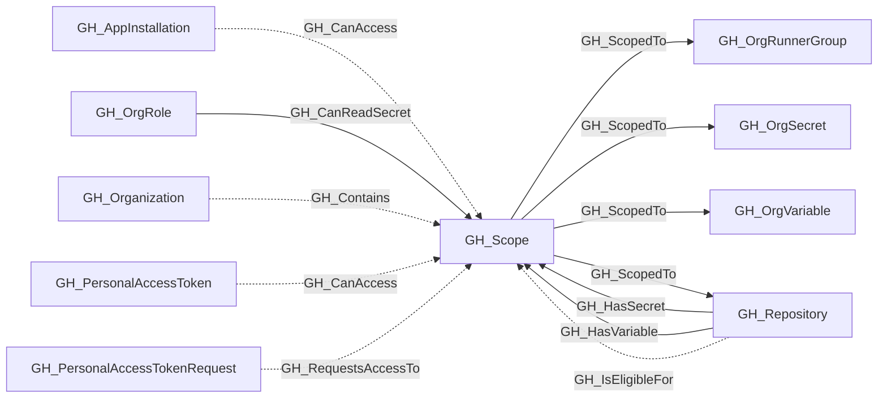

# GH_Scope

## General Information

Represents a reusable, organization-scoped asset set. Its `scope_type` identifies the kind of asset being grouped and its `scope` identifies the canonical selector. Repository, runner-group, organization-secret, and organization-variable scopes support `all` and `private_or_internal`, matching GitHub's organization-policy semantics. GH_ScopedTo is traversable so an incoming traversable capability reaches each member.

Arbitrary app `selected` and PAT `subset` selections are not repository-scope nodes. Those selections remain direct GH_CanAccess relationships. A pending all-repository PAT request uses GH_RequestsAccessTo rather than GH_CanAccess because approval has not granted the requested access.

Repositories receive capability boundary edges only when the target scope has at least one matching collected runner group, organization secret, or organization variable. Populated organization-secret scopes similarly receive GH_CanReadSecret from the owners role and, where repository creation policy permits it, the members role. This avoids expanding empty scope families in sparse organizations while retaining owner exposure when the organization currently has no repositories.

## Properties

| Property | Type | Description |
| --- | --- | --- |
| `name` | `string` | The node name used for matching and display. |
| `displayname` | `string` | The human-readable display name. |
| `environmentid` | `string` | The identifier of the GitHub environment where this node was collected. |
| `last_seen` | `datetime` | The timestamp when this node was last observed during collection. |
| `node_id` | `string` | The stable identifier used as the OpenGraph node ID; this is the native GitHub node ID where available. |
| `collected` | `boolean` | The collected value. |
| `scope_type` | `string` | The scope type value. |
| `scope` | `string` | The scope value. |
| `member_count` | `integer` | Number of collected assets reached through outgoing `GH_ScopedTo` edges. |
| `environment_name` | `string` | The environment name value. |

## Diagram

