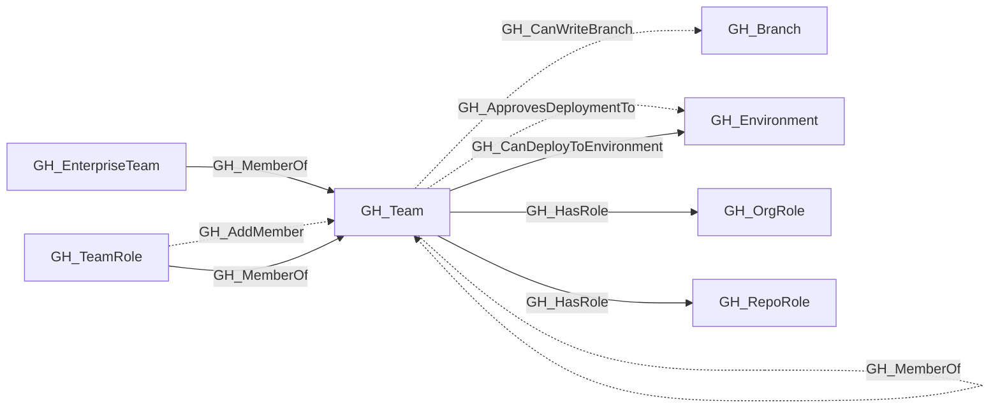

# GH_Team

## General Information

Represents a GitHub team within the organization. Teams can have parent-child relationships, contain members with different roles (Member, Maintainer), and be assigned to repository roles.

## Properties

| Property | Type | Description |
| --- | --- | --- |
| `name` | `string` | The node name used for matching and display. |
| `displayname` | `string` | The human-readable display name. |
| `environmentid` | `string` | The identifier of the GitHub environment where this node was collected. |
| `last_seen` | `datetime` | The timestamp when this node was last observed during collection. |
| `node_id` | `string` | The stable identifier used as the OpenGraph node ID; this is the native GitHub node ID where available. |
| `collected` | `boolean` | Collected/generated by OpenHound. |
| `github_team_id` | `string` | The raw GitHub team node ID. |
| `slug` | `string` | The team's URL-safe slug identifier. |
| `description` | `string` | The team's description. |
| `privacy` | `string` | The team's privacy level (e.g., `visible`, `secret`). |
| `type` | `string` | The team type, such as `enterprise` for projected enterprise teams. |
| `external_group_id` | `integer` | GitHub's org-scoped external IdP group identifier. |
| `external_group_name` | `string` | The external IdP group name reported by GitHub. |
| `environment_name` | `string` | The name of the environment (GitHub organization). |
| `query_first_degree_members` | `string` | Query for first degree members. |
| `query_unrolled_members` | `string` | Query for unrolled members. |
| `query_first_degree_maintainers` | `string` | Query for first degree maintainers. |
| `query_unrolled_maintainers` | `string` | Query for unrolled maintainers. |
| `query_repositories` | `string` | Query for repositories. |
| `query_child_teams` | `string` | Query for child teams. |

## Diagram

