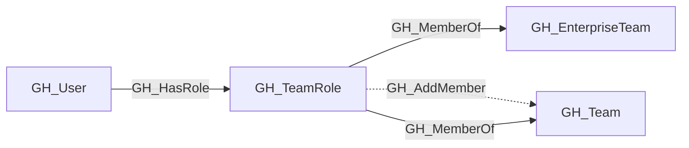

# GH_TeamRole

## General Information

Represents a role within a GitHub team. Each team has two built-in roles: Member and Maintainer. Maintainers can add and remove team members. Team roles connect users to teams and transitively to any repository roles assigned to the team.

## Properties

| Property | Type | Description |
| --- | --- | --- |
| `name` | `string` | The node name used for matching and display. |
| `displayname` | `string` | The human-readable display name. |
| `environmentid` | `string` | The identifier of the GitHub environment where this node was collected. |
| `last_seen` | `datetime` | The timestamp when this node was last observed during collection. |
| `node_id` | `string` | The stable identifier used as the OpenGraph node ID; this is the native GitHub node ID where available. |
| `short_name` | `string` | The short role name: `member` or `maintainer`. |
| `type` | `string` | Always `default` for team roles. |
| `team_name` | `string` | The team name property. |
| `team_id` | `string` | The team id property. |
| `environment_name` | `string` | The name of the environment (GitHub organization). |
| `query_team` | `string` | Query for team. |
| `query_members` | `string` | Query for members. |
| `query_repositories` | `string` | Query for repositories. |

## Diagram

