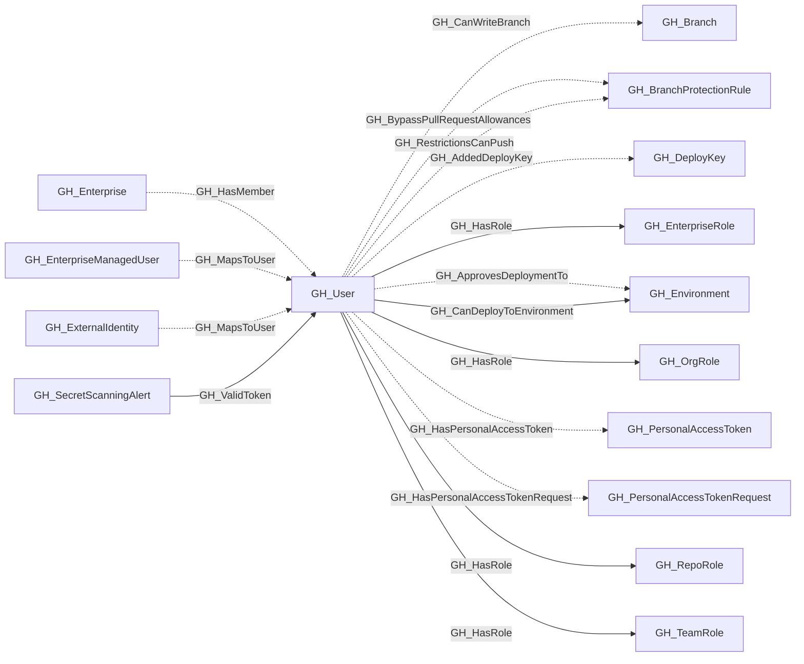

# GH_User

## General Information

Represents a GitHub user who is a member of the organization. Users are associated with organization roles (Owner or Member) and can be assigned to repository roles and team roles.

## Properties

| Property | Type | Description |
| --- | --- | --- |
| `name` | `string` | The node name used for matching and display. |
| `displayname` | `string` | The human-readable display name. |
| `environmentid` | `string` | The identifier of the GitHub environment where this node was collected. |
| `last_seen` | `datetime` | The timestamp when this node was last observed during collection. |
| `node_id` | `string` | The stable identifier used as the OpenGraph node ID; this is the native GitHub node ID where available. |
| `collected` | `boolean` | Collected/generated by OpenHound. |
| `login` | `string` | The user's GitHub login handle. |
| `full_name` | `string` | The user's full name from their profile. |
| `company` | `string` | The company listed on the user's profile. |
| `email` | `string` | The user's public email address. |
| `environment_name` | `string` | The name of the environment (GitHub organization) the user belongs to. |
| `query_personal_access_tokens` | `string` | Query for personal access tokens. |
| `query_roles` | `string` | Query for roles. |
| `query_teams` | `string` | Query for teams. |
| `query_repositories` | `string` | Query for repositories. |
| `query_branches` | `string` | Query for branches. |

## Diagram

