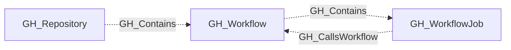

# GH_Workflow

## General Information

Represents a GitHub Actions workflow defined in a repository. Workflow nodes capture the workflow definition metadata including its file path, state, containing repository, and the full YAML contents of the workflow file. Only repositories with GitHub Actions enabled are queried for workflows.

## Properties

| Property | Type | Description |
| --- | --- | --- |
| `name` | `string` | The node name used for matching and display. |
| `displayname` | `string` | The human-readable display name. |
| `environmentid` | `string` | The identifier of the GitHub environment where this node was collected. |
| `last_seen` | `datetime` | The timestamp when this node was last observed during collection. |
| `node_id` | `string` | The stable identifier used as the OpenGraph node ID; this is the native GitHub node ID where available. |
| `short_name` | `string` | The workflow's display name. |
| `path` | `string` | The file path of the workflow definition (e.g., `.github/workflows/ci.yml`). |
| `state` | `string` | The workflow state (e.g., `active`, `disabled_manually`). |
| `url` | `string` | The API URL for the workflow. |
| `repository_name` | `string` | The full name of the containing repository. |
| `repository_id` | `string` | The node_id of the containing repository. |
| `html_url` | `string` | The GitHub web URL for the workflow file. |
| `branch` | `string` | The branch where the workflow file was found. |
| `contents` | `string` | The content of the workflow file. |
| `triggers` | `list[string]` | The triggers value. |
| `trigger_dispatch_inputs` | `list[string]` | The trigger dispatch inputs value. |
| `is_pwn_requestable` | `boolean` | The is pwn requestable value. |
| `query_repository` | `string` | Query for repository. |
| `query_jobs` | `string` | Query for workflow jobs. |
| `query_execution` | `string` | Query for workflow executions. |
| `query_references` | `string` | Query for workflow references (secrets and variables). |
| `query_editors` | `string` | Query for editors. |
| `environment_name` | `string` | The name of the environment (GitHub organization). |

## Diagram

