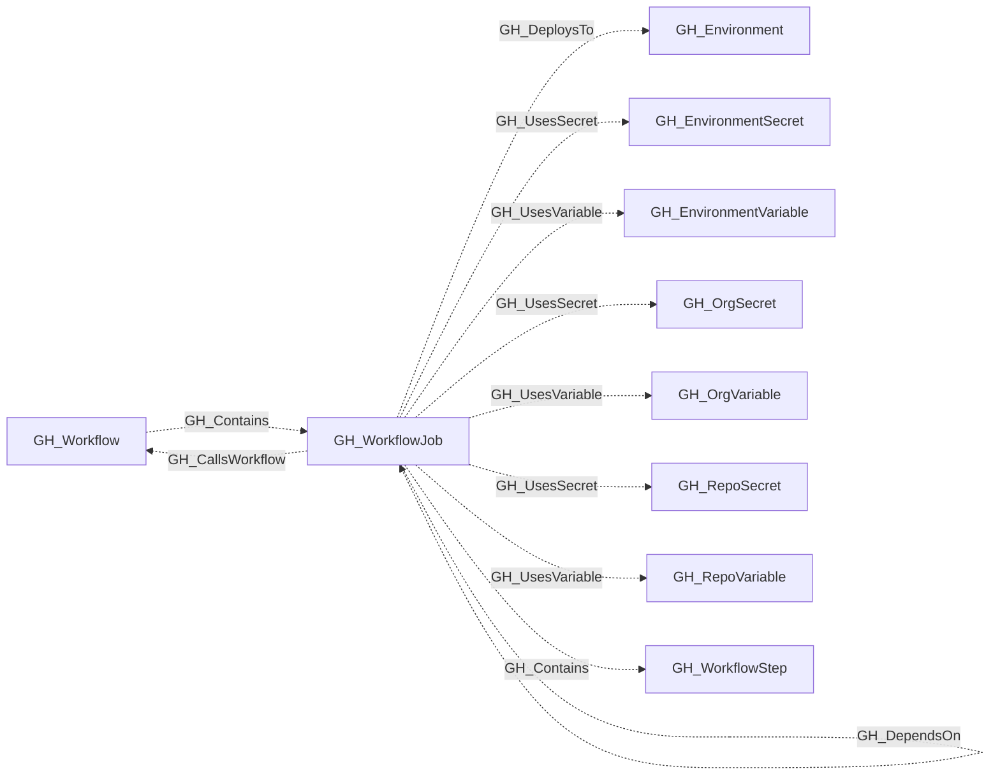

# GH_WorkflowJob

## General Information

Represents a single job within a GitHub Actions workflow. Jobs are the top-level execution units of a workflow — they run on a runner, hold a set of steps, and can declare permissions, environments, and dependencies on other jobs.

## Properties

| Property | Type | Description |
| --- | --- | --- |
| `name` | `string` | The node name used for matching and display. |
| `displayname` | `string` | The human-readable display name. |
| `environmentid` | `string` | The identifier of the GitHub environment where this node was collected. |
| `last_seen` | `datetime` | The timestamp when this node was last observed during collection. |
| `node_id` | `string` | The stable identifier used as the OpenGraph node ID; this is the native GitHub node ID where available. |
| `job_key` | `string` | The YAML key for the job. |
| `runs_on` | `list[string]` | The runner label expression for the job. |
| `is_self_hosted` | `boolean` | Whether the job targets self-hosted runners. |
| `container` | `string` | The optional container configuration. |
| `environment` | `string` | The deployment environment name. |
| `permissions` | `list[string]` | Effective job permissions. |
| `uses_reusable` | `string` | The reusable workflow reference used by this job. |
| `workflow_node_id` | `string` | The parent workflow node ID. |
| `repository_name` | `string` | The containing repository name. |
| `repository_id` | `string` | The containing repository node ID. |
| `environment_name` | `string` | The name of the GitHub organization. |
| `query_repository` | `string` | Query for repository. |
| `query_steps` | `string` | Query for workflow steps. |
| `query_references` | `string` | Query for workflow references (secrets and variables). |

## Diagram

