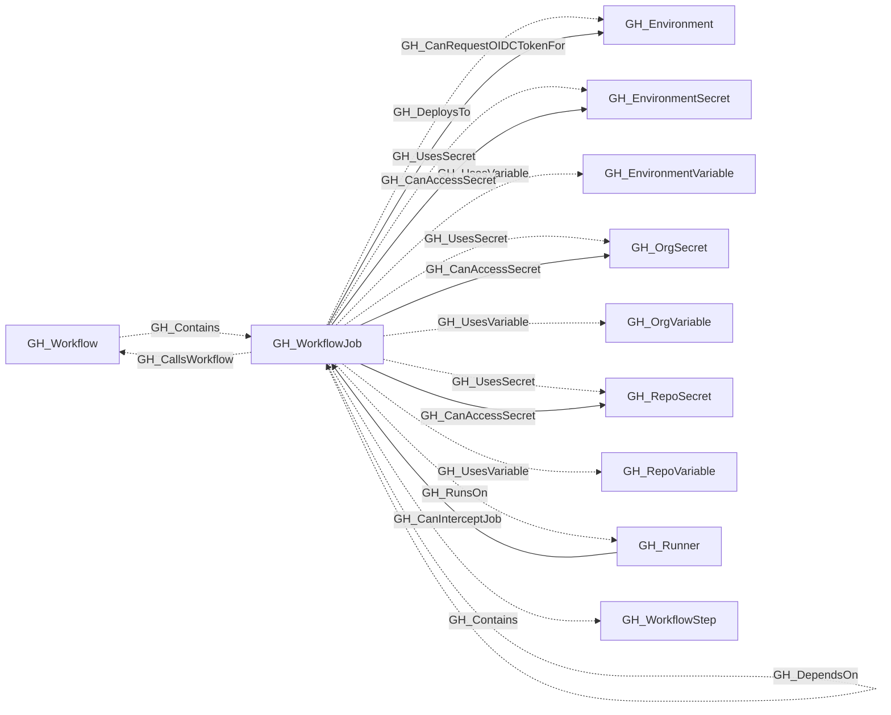

# GH_WorkflowJob

## General Information

Represents a single job within a GitHub Actions workflow. Jobs are the top-level execution units of a workflow — they run on a runner, hold a set of steps, and can declare permissions, environments, and dependencies on other jobs.

When the job has a statically resolvable self-hosted `runs-on` selector, GH_RunsOn edges identify each GH_Runner that currently satisfies the declared label and runner-group constraints under the repository's runner access policy. These edges represent schedulability, not historical execution.

When present, `job_permissions` captures the job-level `permissions` declaration from the workflow YAML. `effective_github_token_permissions` captures the calculated static `GITHUB_TOKEN` permissions after applying the repository default, workflow-level declaration, and job-level declaration.

GH_CanAccessSecret edges identify secrets statically referenced by the job's modeled steps or job-level `env` block that the job execution context can access. GH_CanInterceptJob edges from GH_Runner nodes not explicitly marked ephemeral identify jobs whose future execution context may be exposed if that runner is controlled. When a job targets an environment and its effective permissions include `id-token:write`, GH_CanRequestOIDCTokenFor identifies the environment OIDC context that code executing in the job can request.

When `runs_on_is_dynamic` is true, runner matching and interception status remain unresolved: the collector does not emit GH_CanInterceptJob edges for the job, so `query_interceptable_jobs` cannot match it and the absence of an edge must not be treated as evidence that the job is definitively non-interceptable.

## Properties

| Property | Type | Description |
| --- | --- | --- |
| `name` | `string` | The node name used for matching and display. |
| `displayname` | `string` | The human-readable display name. |
| `environmentid` | `string` | The identifier of the GitHub environment where this node was collected. |
| `last_seen` | `datetime` | The timestamp when this node was last observed during collection. |
| `node_id` | `string` | The stable identifier used as the OpenGraph node ID; this is the native GitHub node ID where available. |
| `job_key` | `string` | The YAML key for the job. |
| `runs_on` | `list[string]` | The runner label expression for the job. |
| `runs_on_group` | `string` | The statically declared runner group, if any. |
| `runs_on_labels` | `list[string]` | The normalized runner labels from runs-on. |
| `runs_on_is_dynamic` | `boolean` | Whether runs-on contains a GitHub Actions expression. |
| `is_self_hosted` | `boolean` | Whether the job targets self-hosted runners. |
| `container` | `string` | The optional container configuration. |
| `environment` | `string` | The deployment environment name. |
| `permissions` | `list[string]` | Applicable declared workflow or job permissions after job-over-workflow precedence. |
| `job_permissions` | `list[string]` | Optional permissions declared at the job level; absent when the job has no declaration. |
| `effective_github_token_permissions` | `list[string]` | Calculated GITHUB_TOKEN permissions after repository defaults and declarations are applied. |
| `uses_reusable` | `string` | The reusable workflow reference used by this job. |
| `workflow_node_id` | `string` | The parent workflow node ID. |
| `repository_name` | `string` | The containing repository name. |
| `repository_id` | `string` | The containing repository node ID. |
| `environment_name` | `string` | The name of the GitHub organization. |
| `query_repository` | `string` | Query for repository. |
| `query_steps` | `string` | Query for workflow steps. |
| `query_references` | `string` | Query for workflow references (secrets and variables). |
| `query_runners` | `string` | Query for eligible self-hosted runners. |
| `query_accessible_secrets` | `string` | Query for secrets accessible to the job execution context. |

## Diagram

