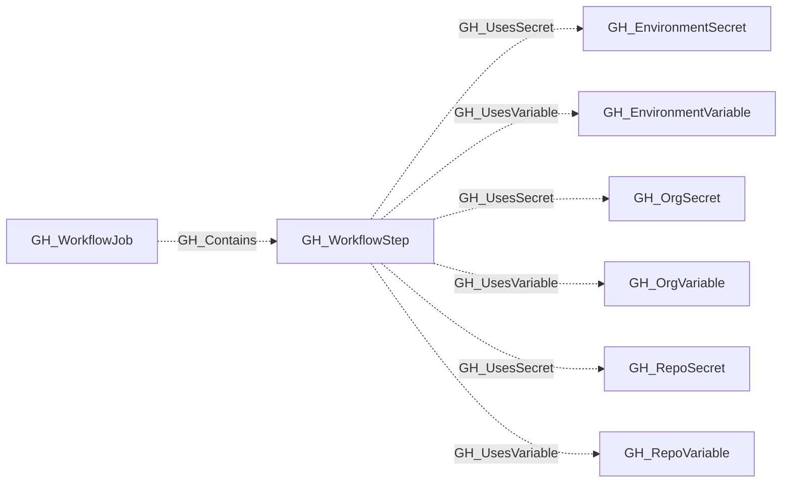

# GH_WorkflowStep

## General Information

Represents a single step within a GitHub Actions job. A step is either a `uses:` action reference or a `run:` shell command. Steps are the leaf nodes of the workflow execution tree and are the primary location where secrets and variables are consumed.

## Properties

| Property | Type | Description |
| --- | --- | --- |
| `name` | `string` | The node name used for matching and display. |
| `displayname` | `string` | The human-readable display name. |
| `environmentid` | `string` | The identifier of the GitHub environment where this node was collected. |
| `last_seen` | `datetime` | The timestamp when this node was last observed during collection. |
| `node_id` | `string` | The stable identifier used as the OpenGraph node ID; this is the native GitHub node ID where available. |
| `step_index` | `integer` | The zero-based step index within the parent job. |
| `type` | `string` | The step type: `uses`, `run`, or `unknown`. |
| `action` | `string` | The full action reference from `uses`. |
| `action_slug` | `string` | The action owner/name without ref. |
| `action_owner` | `string` | The action owner. |
| `action_name` | `string` | The action name. |
| `action_ref` | `string` | The action ref. |
| `is_pinned` | `boolean` | Whether the action ref is a full commit SHA. |
| `run` | `string` | The shell command body for `run` steps. |
| `contents` | `string` | The full parsed step definition. |
| `job_node_id` | `string` | The parent workflow job node ID. |
| `workflow_node_id` | `string` | The parent workflow node ID. |
| `repository_name` | `string` | The containing repository name. |
| `repository_id` | `string` | The containing repository node ID. |
| `environment_name` | `string` | The name of the GitHub organization. |
| `query_repository` | `string` | Query for containing repository. |
| `query_references` | `string` | Query for secrets and variables referenced by the step. |

## Diagram

