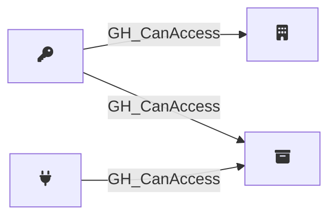

## Edge Schema

Traversable: ❌

| Start | Kind | End |
|-------|-----------|-------|
| [GH_PersonalAccessToken](/opengraph/extensions/githound/reference/nodes/gh_personalaccesstoken) | GH_CanAccess | [GH_Organization](/opengraph/extensions/githound/reference/nodes/gh_organization) |
| [GH_AppInstallation](/opengraph/extensions/githound/reference/nodes/gh_appinstallation) | GH_CanAccess | [GH_Repository](/opengraph/extensions/githound/reference/nodes/gh_repository) |
| [GH_PersonalAccessToken](/opengraph/extensions/githound/reference/nodes/gh_personalaccesstoken) | GH_CanAccess | [GH_Repository](/opengraph/extensions/githound/reference/nodes/gh_repository) |

## General Information

The non-traversable [GH_CanAccess](/opengraph/extensions/githound/reference/edges/gh_canaccess) edge indicates that a personal access token or app installation has been granted access to specific repositories. It is created by `Git-HoundPersonalAccessToken` and `Git-HoundPersonalAccessTokenRequest` for PATs, and by `Git-HoundAppInstallation` for app installations. This edge represents the scope of access granted to a token or app rather than a direct attack path, providing visibility into which repositories are reachable through non-human credentials. It is non-traversable because token and app access does not transitively extend to other principals.
