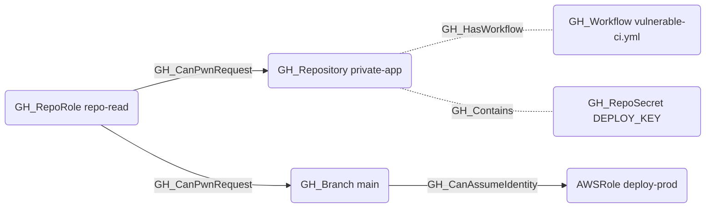

## Edge Schema

Traversable: ✅

## General Information

The traversable `GH_CanPwnRequest` edge indicates that a repository role can exploit a pwn-requestable workflow to execute arbitrary code with the base branch's secrets, GITHUB_TOKEN permissions, and OIDC identity. Created by `Get-PwnRequestEdges`, this is a computed edge that combines workflow analysis with repository access and fork policy evaluation.

### Pwn Request Conditions

A workflow is considered pwn-requestable (`is_pwn_requestable = true`) when **all** of the following are true:

1. **`pull_request_target` trigger**: The workflow is triggered by `pull_request_target`, which runs in the context of the base branch (not the fork) and has access to the base branch's secrets and permissions.
2. **Attacker-controlled checkout**: A step uses `actions/checkout` with a `ref` parameter pointing to the pull request head, meaning attacker-supplied code from the fork replaces the trusted repository contents. Detected ref patterns:
   - `${{ github.event.pull_request.head.sha }}`
   - `${{ github.event.pull_request.head.ref }}`
   - `${{ github.head_ref }}`

### Edge Drawing Conditions

An edge is drawn from a [GH_RepoRole](/opengraph/extensions/githound/reference/nodes/gh_reporole) to the repository (and its branches) when:

1. **Read access**: The role has a [GH_ReadRepoContents](/opengraph/extensions/githound/reference/edges/gh_readrepocontents) edge to the repository (read access is the minimum required to fork).
2. **Forkability**: The repository can be forked by the role holder:
   - **Public repos**: Always forkable by anyone on GitHub.
   - **Private/internal repos**: Requires both the organization setting `members_can_fork_private_repositories = true` AND the repository setting `allow_forking = true`.
3. **Pwn-requestable workflow**: The repository has at least one workflow with `is_pwn_requestable = true`.

### Branch Targeting

- If the `pull_request_target` trigger has a `branches:` filter (e.g., `branches: [main]`), edges are drawn only to matching branches and the repository.
- If unconstrained, edges are drawn to the repository and all of its branches.

### Attack Impact

An attacker who exploits a pwn request gains code execution in the workflow runner with access to:

- **Repository secrets** scoped to the base branch
- **Organization secrets** accessible by the repository
- **GITHUB_TOKEN** with the workflow's declared permissions (often `write`)
- **OIDC tokens** if `id-token: write` is set, enabling cloud identity assumption via [GH_CanAssumeIdentity](/opengraph/extensions/githound/reference/edges/gh_canassumeidentity)
- **Environment secrets** if the workflow job targets a deployment environment

### Caveats

- **OIDC traversal requires `id-token: write`**: The attack chain from `GH_CanPwnRequest` through [GH_CanAssumeIdentity](/opengraph/extensions/githound/reference/edges/gh_canassumeidentity) to a cloud role is only valid if the pwn-requestable workflow (or job) explicitly declares `id-token: write` in its `permissions:` block. The `id-token` permission defaults to `none` and is never implicitly granted — even when the workflow has no `permissions:` block at all. The `permissions` property on the [GH_WorkflowJob](/opengraph/extensions/githound/reference/nodes/gh_workflowjob) node can be inspected to verify this.
- **GITHUB_TOKEN permissions**: The `permissions:` block controls what the `GITHUB_TOKEN` can do (e.g., push commits, create releases), but has no effect on secret access, OIDC token requests (governed separately by `id-token`), or arbitrary code execution. A workflow with `contents: read` is still fully exploitable via pwn request for secret exfiltration and lateral movement — only write-back to the repository is limited.

