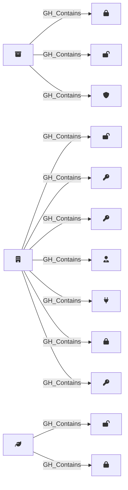

## Edge Schema

Traversable: ❌

| Start | Kind | End |
|-------|-----------|-------|
| [GH_Repository](/opengraph/extensions/githound/reference/nodes/gh_repository) | GH_Contains | [GH_RepoSecret](/opengraph/extensions/githound/reference/nodes/gh_reposecret) |
| [GH_Repository](/opengraph/extensions/githound/reference/nodes/gh_repository) | GH_Contains | [GH_RepoVariable](/opengraph/extensions/githound/reference/nodes/gh_repovariable) |
| [GH_Organization](/opengraph/extensions/githound/reference/nodes/gh_organization) | GH_Contains | [GH_OrgVariable](/opengraph/extensions/githound/reference/nodes/gh_orgvariable) |
| [GH_Organization](/opengraph/extensions/githound/reference/nodes/gh_organization) | GH_Contains | [GH_SecretScanningAlert](/opengraph/extensions/githound/reference/nodes/gh_secretscanningalert) |
| [GH_Organization](/opengraph/extensions/githound/reference/nodes/gh_organization) | GH_Contains | [GH_PersonalAccessToken](/opengraph/extensions/githound/reference/nodes/gh_personalaccesstoken) |
| [GH_Organization](/opengraph/extensions/githound/reference/nodes/gh_organization) | GH_Contains | [GH_OrgRole](/opengraph/extensions/githound/reference/nodes/gh_orgrole) |
| [GH_Environment](/opengraph/extensions/githound/reference/nodes/gh_environment) | GH_Contains | [GH_EnvironmentVariable](/opengraph/extensions/githound/reference/nodes/gh_environmentvariable) |
| [GH_Repository](/opengraph/extensions/githound/reference/nodes/gh_repository) | GH_Contains | [GH_BranchProtectionRule](/opengraph/extensions/githound/reference/nodes/gh_branchprotectionrule) |
| [GH_Organization](/opengraph/extensions/githound/reference/nodes/gh_organization) | GH_Contains | [GH_AppInstallation](/opengraph/extensions/githound/reference/nodes/gh_appinstallation) |
| [GH_Organization](/opengraph/extensions/githound/reference/nodes/gh_organization) | GH_Contains | [GH_OrgSecret](/opengraph/extensions/githound/reference/nodes/gh_orgsecret) |
| [GH_Organization](/opengraph/extensions/githound/reference/nodes/gh_organization) | GH_Contains | [GH_PersonalAccessTokenRequest](/opengraph/extensions/githound/reference/nodes/gh_personalaccesstokenrequest) |
| [GH_Environment](/opengraph/extensions/githound/reference/nodes/gh_environment) | GH_Contains | [GH_EnvironmentSecret](/opengraph/extensions/githound/reference/nodes/gh_environmentsecret) |

## General Information

The non-traversable [GH_Contains](/opengraph/extensions/githound/reference/edges/gh_contains) edge represents structural containment within the GitHub resource hierarchy. The organization serves as the top-level container for users, teams, repositories, roles, secrets, app installations, and personal access tokens. Repositories contain their own repo-level secrets, and environments contain environment-scoped secrets. This edge is created by the collector to establish the organizational hierarchy of GitHub resources and is not traversable because containment alone does not imply privilege escalation.
