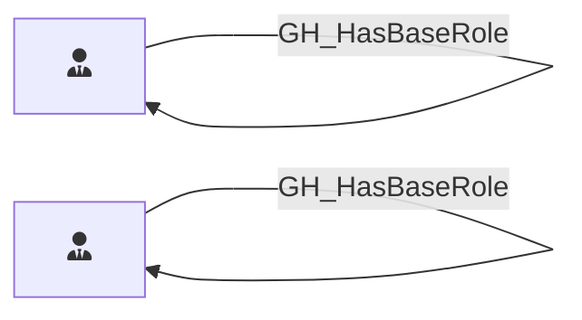

## Edge Schema

Traversable: ✅

| Start | Kind | End |
|-------|-----------|-------|
| [GH_OrgRole](/opengraph/extensions/githound/reference/nodes/gh_orgrole) | [GH_HasBaseRole](/opengraph/extensions/githound/reference/edges/gh_hasbaserole) | [GH_OrgRole](/opengraph/extensions/githound/reference/nodes/gh_orgrole) |
| [GH_RepoRole](/opengraph/extensions/githound/reference/nodes/gh_reporole) | [GH_HasBaseRole](/opengraph/extensions/githound/reference/edges/gh_hasbaserole) | [GH_RepoRole](/opengraph/extensions/githound/reference/nodes/gh_reporole) |

## General Information

The traversable [GH_HasBaseRole](/opengraph/extensions/githound/reference/edges/gh_hasbaserole) edge represents role inheritance within the GitHub permission hierarchy. Org roles inherit down to all-repo roles (e.g., Owners inherits to all_repo_admin), and custom roles inherit from their base roles (e.g., a custom_role inherits from write). It is created by `Git-HoundOrganization` (for org-to-repo role inheritance) and `Git-HoundRepository` (for repo-level role inheritance). This edge is traversable because it extends permissions through the role hierarchy, meaning a principal with a higher-level role implicitly holds all inherited lower-level roles.
