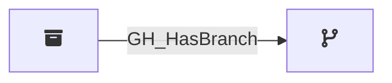

## Edge Schema

Traversable: ❌

| Start | Kind | End |
|-------|-----------|-------|
| [GH_Repository](/opengraph/extensions/githound/reference/nodes/gh_repository) | GH_HasBranch | [GH_Branch](/opengraph/extensions/githound/reference/nodes/gh_branch) |

## General Information

The non-traversable `GH_HasBranch` edge represents the relationship between a repository and its branches. Created by `Git-HoundBranch`, this edge links each collected branch to its parent repository. It is a structural edge that provides the foundation for understanding branch-level protections and access controls. While not traversable itself, it connects repositories to branches where traversable edges like [GH_CanWriteBranch](/opengraph/extensions/githound/reference/edges/gh_canwritebranch) and [GH_CanEditProtection](/opengraph/extensions/githound/reference/edges/gh_caneditprotection) model the effective access.
