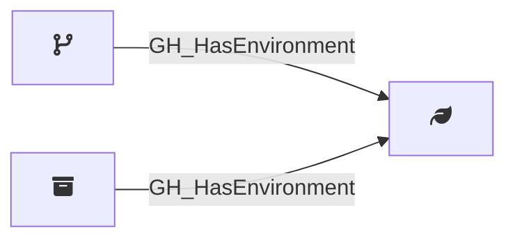

## Edge Schema

Traversable: ❌

| Start | Kind | End |
|-------|-----------|-------|
| [GH_Branch](/opengraph/extensions/githound/reference/nodes/gh_branch) | GH_HasEnvironment | [GH_Environment](/opengraph/extensions/githound/reference/nodes/gh_environment) |
| [GH_Repository](/opengraph/extensions/githound/reference/nodes/gh_repository) | GH_HasEnvironment | [GH_Environment](/opengraph/extensions/githound/reference/nodes/gh_environment) |

## General Information

The non-traversable [GH_HasEnvironment](/opengraph/extensions/githound/reference/edges/gh_hasenvironment) edge represents the relationship between a repository or branch and its deployment environments. Created by `Git-HoundEnvironment`, this edge links environments to the repositories that define them and to the branches that are allowed to deploy to them (via deployment branch policies). Environments are security-relevant because they can gate access to secrets and cloud credentials, and their deployment branch policies control which branches can trigger deployments.
