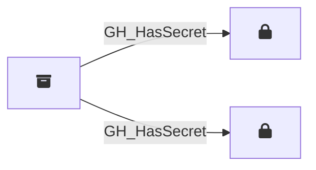

## Edge Schema

Traversable: ✅

| Start | Kind | End |
|-------|-----------|-------|
| [GH_Repository](/opengraph/extensions/githound/reference/nodes/gh_repository) | GH_HasSecret | [GH_RepoSecret](/opengraph/extensions/githound/reference/nodes/gh_reposecret) |
| [GH_Repository](/opengraph/extensions/githound/reference/nodes/gh_repository) | GH_HasSecret | [GH_OrgSecret](/opengraph/extensions/githound/reference/nodes/gh_orgsecret) |

## General Information

The traversable `GH_HasSecret` edge represents the relationship between a repository or environment and the secrets accessible within that context. Created by `Git-HoundOrganizationSecret`, `Git-HoundSecret`, and `Git-HoundEnvironment`, this edge shows which secrets are available in which scopes. Repositories can have access to both organization-level secrets (scoped to selected repositories) and repository-level secrets, while environments contain their own environment-scoped secrets. This edge is traversable because any principal that can push code to a repository (via [GH_CanWriteBranch](/opengraph/extensions/githound/reference/edges/gh_canwritebranch) or [GH_CanCreateBranch](/opengraph/extensions/githound/reference/edges/gh_cancreatebranch)) can write a workflow that exfiltrates the secret values at runtime, making this a meaningful link in attack path analysis.
