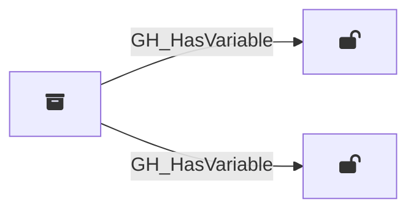

## Edge Schema

Traversable: ✅

| Start | Kind | End |
|-------|-----------|-------|
| [GH_Repository](/opengraph/extensions/githound/reference/nodes/gh_repository) | GH_HasVariable | [GH_RepoVariable](/opengraph/extensions/githound/reference/nodes/gh_repovariable) |
| [GH_Repository](/opengraph/extensions/githound/reference/nodes/gh_repository) | GH_HasVariable | [GH_OrgVariable](/opengraph/extensions/githound/reference/nodes/gh_orgvariable) |

## General Information

The traversable `GH_HasVariable` edge represents the relationship between a repository and the variables accessible within that context. Created by `Git-HoundOrganizationSecret` and `Git-HoundVariable`, this edge shows which variables are available in which scopes. Repositories can have access to both organization-level variables (scoped by visibility to all, private, or selected repositories) and repository-level variables defined directly on the repo. This edge is traversable because any principal that can push code to a repository (via [GH_CanWriteBranch](/opengraph/extensions/githound/reference/edges/gh_canwritebranch) or [GH_CanCreateBranch](/opengraph/extensions/githound/reference/edges/gh_cancreatebranch)) can write a workflow that reads variable values at runtime, and variables may contain configuration data useful for lateral movement such as deployment URLs, service names, or environment identifiers.
