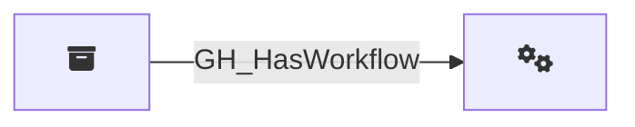

## Edge Schema

Traversable: ❌

| Start | Kind | End |
|-------|-----------|-------|
| [GH_Repository](/opengraph/extensions/githound/reference/nodes/gh_repository) | GH_HasWorkflow | [GH_Workflow](/opengraph/extensions/githound/reference/nodes/gh_workflow) |

## General Information

The non-traversable [GH_HasWorkflow](/opengraph/extensions/githound/reference/edges/gh_hasworkflow) edge represents the relationship between a repository and its GitHub Actions workflows. Created by `Git-HoundWorkflow`, this edge links each discovered workflow definition to its parent repository. Workflows are significant from a security perspective because they can execute arbitrary code with repository permissions, access secrets, and assume cloud identities. This structural edge enables analysts to enumerate which workflows exist in a given repository.
