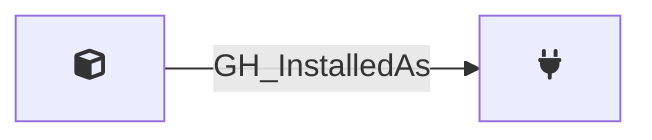

## Edge Schema

Traversable: ✅

| Start | Kind | End |
|-------|-----------|-------|
| [GH_App](/opengraph/extensions/githound/reference/nodes/gh_app) | GH_InstalledAs | [GH_AppInstallation](/opengraph/extensions/githound/reference/nodes/gh_appinstallation) |

## General Information

The traversable [GH_InstalledAs](/opengraph/extensions/githound/reference/edges/gh_installedas) edge links a GitHub App to its installation within the organization. It is created by `Git-HoundAppInstallation` during app installation enumeration. This edge is traversable because it connects the app definition to its active installation, which determines the specific set of repositories and permissions the app has been granted. Understanding the relationship between an app and its installation is essential for tracing how app-level permissions translate into repository access.
