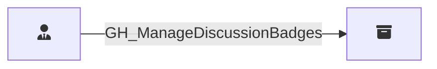

## Edge Schema

Traversable: ❌

| Start | Kind | End |
|-------|-----------|-------|
| [GH_RepoRole](/opengraph/extensions/githound/reference/nodes/gh_reporole) | GH_ManageDiscussionBadges | [GH_Repository](/opengraph/extensions/githound/reference/nodes/gh_repository) |

## General Information

The non-traversable [GH_ManageDiscussionBadges](/opengraph/extensions/githound/reference/edges/gh_managediscussionbadges) edge represents a role's ability to manage discussion badges used to highlight discussion participants. This permission is available to Write, Maintain, and Admin roles and custom roles that have been granted this specific permission.
