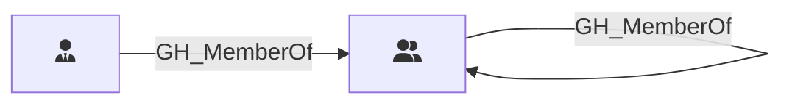

## Edge Schema

Traversable: ✅

| Start | Kind | End |
|-------|-----------|-------|
| [GH_Team](/opengraph/extensions/githound/reference/nodes/gh_team) | GH_MemberOf | [GH_Team](/opengraph/extensions/githound/reference/nodes/gh_team) |
| [GH_TeamRole](/opengraph/extensions/githound/reference/nodes/gh_teamrole) | GH_MemberOf | [GH_Team](/opengraph/extensions/githound/reference/nodes/gh_team) |

## General Information

The traversable `GH_MemberOf` edge represents team membership, linking a team role to its parent team or a child team to a parent team in nested team hierarchies. It is created by `Git-HoundTeam` during team enumeration. This edge is traversable because team membership extends access transitively -- a user who holds a role in a child team inherits the repository permissions of all ancestor teams in the nesting hierarchy, making it a key component of attack path analysis.
