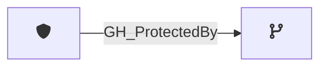

## Edge Schema

Traversable: ❌

| Start | Kind | End |
|-------|-----------|-------|
| [GH_BranchProtectionRule](/opengraph/extensions/githound/reference/nodes/gh_branchprotectionrule) | GH_ProtectedBy | [GH_Branch](/opengraph/extensions/githound/reference/nodes/gh_branch) |

## General Information

The non-traversable [GH_ProtectedBy](/opengraph/extensions/githound/reference/edges/gh_protectedby) edge represents that a branch protection rule applies to a specific branch. Created by `Git-HoundBranch` when branch protection rules are collected, this edge links protection rules to the branches they govern. Understanding which protections apply to a branch is critical for determining the effective access model — protections such as required reviews, status checks, and push restrictions directly impact who can modify a branch. This edge is consumed by the computed edge functions (`Compute-GitHoundBranchAccess`) to determine effective push access; the computed [GH_CanWriteBranch](/opengraph/extensions/githound/reference/edges/gh_canwritebranch) and [GH_CanEditProtection](/opengraph/extensions/githound/reference/edges/gh_caneditprotection) edges carry traversability instead.
