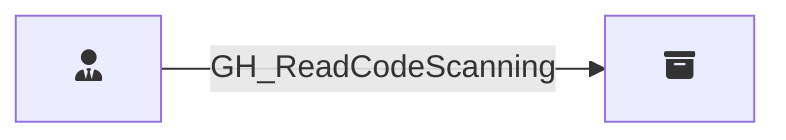

## Edge Schema

Traversable: ❌

| Start | Kind | End |
|-------|-----------|-------|
| [GH_RepoRole](/opengraph/extensions/githound/reference/nodes/gh_reporole) | GH_ReadCodeScanning | [GH_Repository](/opengraph/extensions/githound/reference/nodes/gh_repository) |

## General Information

The non-traversable `GH_ReadCodeScanning` edge represents a role's ability to read code scanning analysis results and alerts. This permission is available to Write, Maintain, and Admin roles and custom roles that have been granted this specific permission. Code scanning alerts may reveal exploitable vulnerabilities in the codebase.
