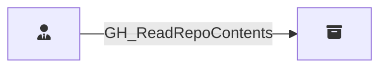

## Edge Schema

Traversable: ❌

| Start | Kind | End |
|-------|-----------|-------|
| [GH_RepoRole](/opengraph/extensions/githound/reference/nodes/gh_reporole) | GH_ReadRepoContents | [GH_Repository](/opengraph/extensions/githound/reference/nodes/gh_repository) |

## General Information

The non-traversable `GH_ReadRepoContents` edge represents a role's ability to read repository contents including source code, issues, and pull requests. This is the base level of repository access, available to all roles at the Read permission level and above (Read, Triage, Write, Maintain, Admin).
