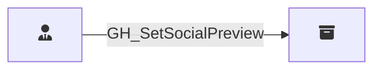

## Edge Schema

Traversable: ❌

| Start | Kind | End |
|-------|-----------|-------|
| [GH_RepoRole](/opengraph/extensions/githound/reference/nodes/gh_reporole) | GH_SetSocialPreview | [GH_Repository](/opengraph/extensions/githound/reference/nodes/gh_repository) |

## General Information

The non-traversable `GH_SetSocialPreview` edge represents a role's ability to set the repository social preview image shown in link previews. This permission is available to Maintain and Admin roles and custom roles that have been granted this specific permission.
