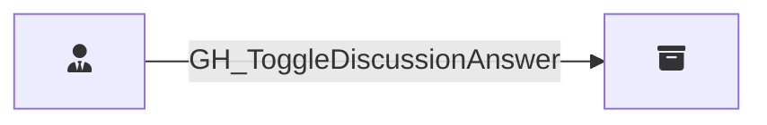

## Edge Schema

Traversable: ❌

| Start | Kind | End |
|-------|-----------|-------|
| [GH_RepoRole](/opengraph/extensions/githound/reference/nodes/gh_reporole) | GH_ToggleDiscussionAnswer | [GH_Repository](/opengraph/extensions/githound/reference/nodes/gh_repository) |

## General Information

The non-traversable [GH_ToggleDiscussionAnswer](/opengraph/extensions/githound/reference/edges/gh_togglediscussionanswer) edge represents a role's ability to mark or unmark a discussion comment as the accepted answer. This permission is available to Triage, Write, Maintain, and Admin roles and custom roles that have been granted this specific permission.
