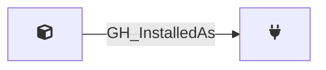

## Description

Represents a GitHub App definition — the registered application entity. The app owner holds the private key that can generate installation access tokens for **every** [GH_AppInstallation](/opengraph/extensions/githound/reference/nodes/gh_appinstallation) of this app. If the private key is compromised, all installations across all organizations are affected.

App definitions are retrieved via the public `GET /apps/{app_slug}` endpoint (no authentication required) after discovering unique app slugs from the organization's app installations.

## Edges

<Note>
The tables below list edges defined by the GitHound extension only. Additional edges to or from this node may be created by other extensions.
</Note>

### Inbound Edges

No incoming edges.

### Outbound Edges

| Start | End | Kind | Description |
|-------|-----|------|-------------|
| GH_App | [GH_AppInstallation](/opengraph/extensions/githound/reference/nodes/gh_appinstallation) | [GH_InstalledAs](/opengraph/extensions/githound/reference/edges/gh_installedas) | App is installed as this installation |

## Properties

::: openfetch_github.models.app_installation.GHAppProperties
    options:
      show_docstring_attributes: true
      inherited_members: true
      members_order: source
