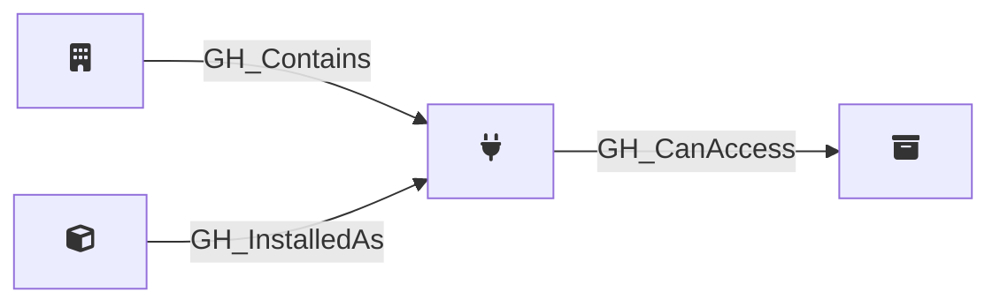

## Description

Represents a GitHub App installed on an organization. App installations have specific permissions and can be scoped to all repositories or a selection of repositories. The permissions granted to the app are captured as a JSON string in the properties.

Each installation is linked to its parent [GH_App](/opengraph/extensions/githound/reference/nodes/gh_app) via a [GH_InstalledAs](/opengraph/extensions/githound/reference/edges/gh_installedas) edge. For installations with `repository_selection` set to `all`, [GH_CanAccess](/opengraph/extensions/githound/reference/edges/gh_canaccess) edges are created to every repository in the organization. For installations with `repository_selection` set to `selected`, repository-level edges cannot be enumerated with a PAT (requires app installation token authentication).

## Edges

<Note>
The tables below list edges defined by the GitHound extension only. Additional edges to or from this node may be created by other extensions.
</Note>

### Inbound Edges

| Start | End | Kind | Description |
|-------|-----|------|-------------|
| [GH_Organization](/opengraph/extensions/githound/reference/nodes/gh_organization) | GH_AppInstallation | [GH_Contains](/opengraph/extensions/githound/reference/edges/gh_contains) | Org contains app installation |
| [GH_App](/opengraph/extensions/githound/reference/nodes/gh_app) | GH_AppInstallation | [GH_InstalledAs](/opengraph/extensions/githound/reference/edges/gh_installedas) | App is installed as this installation |

### Outbound Edges

| Start | End | Kind | Description |
|-------|-----|------|-------------|
| GH_AppInstallation | [GH_Repository](/opengraph/extensions/githound/reference/nodes/gh_repository) | [GH_CanAccess](/opengraph/extensions/githound/reference/edges/gh_canaccess) | App installation can access repository |

## Properties

::: openfetch_github.models.app_installation.GHAppInstallationProperties
    options:
      show_docstring_attributes: true
      inherited_members: true
      members_order: source
