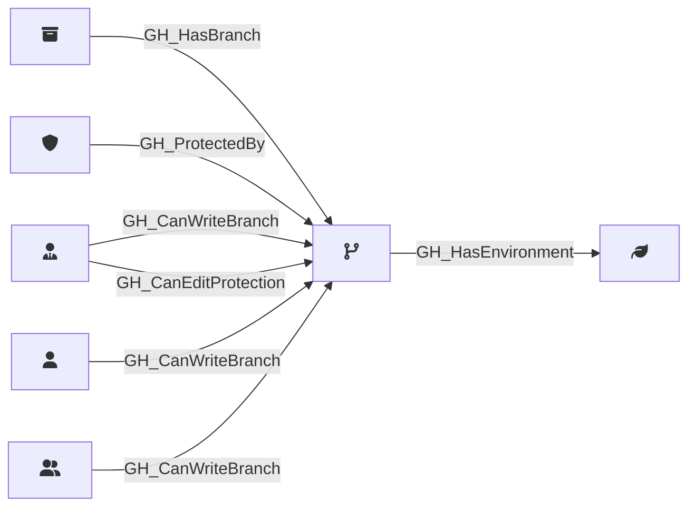

## Description

Represents a Git branch within a repository. Branch nodes capture basic branch information and whether the branch is protected. Protection rule details are stored in separate [GH_BranchProtectionRule](/opengraph/extensions/githound/reference/nodes/gh_branchprotectionrule) nodes, linked via [GH_ProtectedBy](/opengraph/extensions/githound/reference/edges/gh_protectedby) edges.

## Edges

<Note>
The tables below list edges defined by the GitHound extension only. Additional edges to or from this node may be created by other extensions.
</Note>

### Inbound Edges

| Start | End | Kind | Description |
|-------|-----|------|-------------|
| [GH_Repository](/opengraph/extensions/githound/reference/nodes/gh_repository) | GH_Branch | [GH_HasBranch](/opengraph/extensions/githound/reference/edges/gh_hasbranch) | Repository has branch |
| [GH_BranchProtectionRule](/opengraph/extensions/githound/reference/nodes/gh_branchprotectionrule) | GH_Branch | [GH_ProtectedBy](/opengraph/extensions/githound/reference/edges/gh_protectedby) | Branch is protected by rule |
| [GH_RepoRole](/opengraph/extensions/githound/reference/nodes/gh_reporole) | GH_Branch | [GH_CanWriteBranch](/opengraph/extensions/githound/reference/edges/gh_canwritebranch) | Role can push commits to this branch |
| [GH_RepoRole](/opengraph/extensions/githound/reference/nodes/gh_reporole) | GH_Branch | [GH_CanEditProtection](/opengraph/extensions/githound/reference/edges/gh_caneditprotection) | Role can modify or remove the branch protection rule governing this branch |
| [GH_User](/opengraph/extensions/githound/reference/nodes/gh_user) | GH_Branch | [GH_CanWriteBranch](/opengraph/extensions/githound/reference/edges/gh_canwritebranch) | User can push commits to this branch via actor-level bypass allowances |
| [GH_Team](/opengraph/extensions/githound/reference/nodes/gh_team) | GH_Branch | [GH_CanWriteBranch](/opengraph/extensions/githound/reference/edges/gh_canwritebranch) | Team can push commits to this branch via actor-level bypass allowances |

### Outbound Edges

| Start | End | Kind | Description |
|-------|-----|------|-------------|
| GH_Branch | [GH_Environment](/opengraph/extensions/githound/reference/nodes/gh_environment) | [GH_HasEnvironment](/opengraph/extensions/githound/reference/edges/gh_hasenvironment) | Branch pattern can deploy to environment |

## Properties

::: openfetch_github.models.branch.GHBranchProperties
    options:
      show_docstring_attributes: true
      inherited_members: true
      members_order: source
