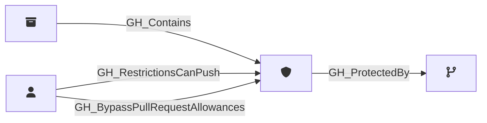

## Description

Represents a branch protection rule configured on a GitHub repository. Protection rules define requirements that must be met before changes can be merged to matching branches, such as required reviews, status checks, and restrictions on who can push.

A single protection rule can apply to multiple branches via pattern matching (e.g., `main`, `release/*`).

## Security Considerations

Branch protection rules are critical security controls. Key settings to review:

- **enforce_admins**: Enforces merge-gate controls (PR reviews, lock branch) for admins and users with `bypass_branch_protection`. Does **not** enforce push-gate controls (`push_restrictions`) for admins or users with `push_protected_branch`.
- **required_pull_request_reviews**: Blocks direct pushes to existing protected branches. Bypassed by [GH_BypassBranchProtection](/opengraph/extensions/githound/reference/edges/gh_bypassbranchprotection) and [GH_BypassPullRequestAllowances](/opengraph/extensions/githound/reference/edges/gh_bypasspullrequestallowances) (both suppressed by `enforce_admins`).
- **push_restrictions**: Restricts who can push. Bypassed by [GH_PushProtectedBranch](/opengraph/extensions/githound/reference/edges/gh_pushprotectedbranch), [GH_AdminTo](/opengraph/extensions/githound/reference/edges/gh_adminto), and [GH_RestrictionsCanPush](/opengraph/extensions/githound/reference/edges/gh_restrictionscanpush) (none suppressed by `enforce_admins`).
- **blocks_creations**: Restricts new branch creation when `push_restrictions` is also `true`. Same bypass vectors as `push_restrictions`. Silently reverts to `false` if `push_restrictions` is disabled.
- **lock_branch**: Makes branch read-only. Bypassed by [GH_BypassBranchProtection](/opengraph/extensions/githound/reference/edges/gh_bypassbranchprotection) (suppressed by `enforce_admins`).
- **require_code_owner_reviews**: If `false`, changes to critical paths may not require owner approval.
- **allows_force_pushes**: Controls whether history rewrites are allowed. Does **not** grant push access — it is not a bypass mechanism.
- **allows_deletions**: If `true`, branches can be deleted (potentially losing code).

### Secret Exfiltration Mitigation

The only branch protection configuration that blocks the write-access → workflow → secrets exfiltration attack path is `push_restrictions` + `blocks_creations` on a `*` pattern rule. However, users with [GH_PushProtectedBranch](/opengraph/extensions/githound/reference/edges/gh_pushprotectedbranch), [GH_AdminTo](/opengraph/extensions/githound/reference/edges/gh_adminto), [GH_RestrictionsCanPush](/opengraph/extensions/githound/reference/edges/gh_restrictionscanpush), or [GH_EditRepoProtections](/opengraph/extensions/githound/reference/edges/gh_editrepoprotections) can bypass this control.

For complete analysis, see [BloodHound Docs: GitHound - Mitigating Controls](/opengraph/extensions/githound/reference/mitigating-controls).

### Identifying Bypass Actors

Use these edges to identify users and teams with elevated branch permissions:

- [GH_BypassPullRequestAllowances](/opengraph/extensions/githound/reference/edges/gh_bypasspullrequestallowances) — can bypass PR requirements on a specific rule (PR reviews only)
- [GH_RestrictionsCanPush](/opengraph/extensions/githound/reference/edges/gh_restrictionscanpush) — can push despite push restrictions on a specific rule
- [GH_BypassBranchProtection](/opengraph/extensions/githound/reference/edges/gh_bypassbranchprotection) — repo-wide bypass of merge-gate controls (PR reviews + lock branch)
- [GH_PushProtectedBranch](/opengraph/extensions/githound/reference/edges/gh_pushprotectedbranch) — repo-wide bypass of push-gate controls (push restrictions + blocks creations)
- [GH_EditRepoProtections](/opengraph/extensions/githound/reference/edges/gh_editrepoprotections) — can remove/modify protection rules entirely

## Edges

<Note>
The tables below list edges defined by the GitHound extension only. Additional edges to or from this node may be created by other extensions.
</Note>

### Inbound Edges

| Start | End | Kind | Description |
|-------|-----|------|-------------|
| [GH_Repository](/opengraph/extensions/githound/reference/nodes/gh_repository) | GH_BranchProtectionRule | [GH_Contains](/opengraph/extensions/githound/reference/edges/gh_contains) | Repository contains branch protection rule |
| [GH_User](/opengraph/extensions/githound/reference/nodes/gh_user) | GH_BranchProtectionRule | [GH_RestrictionsCanPush](/opengraph/extensions/githound/reference/edges/gh_restrictionscanpush) | Actor can push despite push restrictions |
| [GH_User](/opengraph/extensions/githound/reference/nodes/gh_user) | GH_BranchProtectionRule | [GH_BypassPullRequestAllowances](/opengraph/extensions/githound/reference/edges/gh_bypasspullrequestallowances) | Actor can bypass PR review requirements |

### Outbound Edges

| Start | End | Kind | Description |
|-------|-----|------|-------------|
| GH_BranchProtectionRule | [GH_Branch](/opengraph/extensions/githound/reference/nodes/gh_branch) | [GH_ProtectedBy](/opengraph/extensions/githound/reference/edges/gh_protectedby) | Branch is protected by rule |

## Properties

::: openfetch_github.models.branch_protection_rule.GHBranchProtectionRuleProperties
    options:
      show_docstring_attributes: true
      inherited_members: true
      members_order: source
