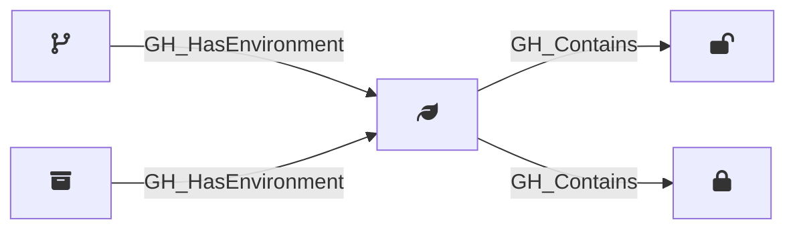

## Description

Represents a GitHub Actions deployment environment configured on a repository. Environments can have protection rules including required reviewers, wait timers, and deployment branch policies. When custom branch policies are configured, the environment is connected to specific branches; otherwise, it is connected directly to the repository.

## Edges

<Note>
The tables below list edges defined by the GitHound extension only. Additional edges to or from this node may be created by other extensions.
</Note>

### Inbound Edges

| Start | End | Kind | Description |
|-------|-----|------|-------------|
| [GH_Branch](/opengraph/extensions/githound/reference/nodes/gh_branch) | GH_Environment | [GH_HasEnvironment](/opengraph/extensions/githound/reference/edges/gh_hasenvironment) | Branch pattern can deploy to environment |
| [GH_Repository](/opengraph/extensions/githound/reference/nodes/gh_repository) | GH_Environment | [GH_HasEnvironment](/opengraph/extensions/githound/reference/edges/gh_hasenvironment) | Repository deploys to environment (no custom branch policy) |

### Outbound Edges

| Start | End | Kind | Description |
|-------|-----|------|-------------|
| GH_Environment | [GH_EnvironmentVariable](/opengraph/extensions/githound/reference/nodes/gh_environmentvariable) | [GH_Contains](/opengraph/extensions/githound/reference/edges/gh_contains) | Environment contains variable |
| GH_Environment | [GH_EnvironmentSecret](/opengraph/extensions/githound/reference/nodes/gh_environmentsecret) | [GH_Contains](/opengraph/extensions/githound/reference/edges/gh_contains) | Environment contains secret |

## Properties

::: openfetch_github.models.environment.GHEnvironmentProperties
    options:
      show_docstring_attributes: true
      inherited_members: true
      members_order: source
